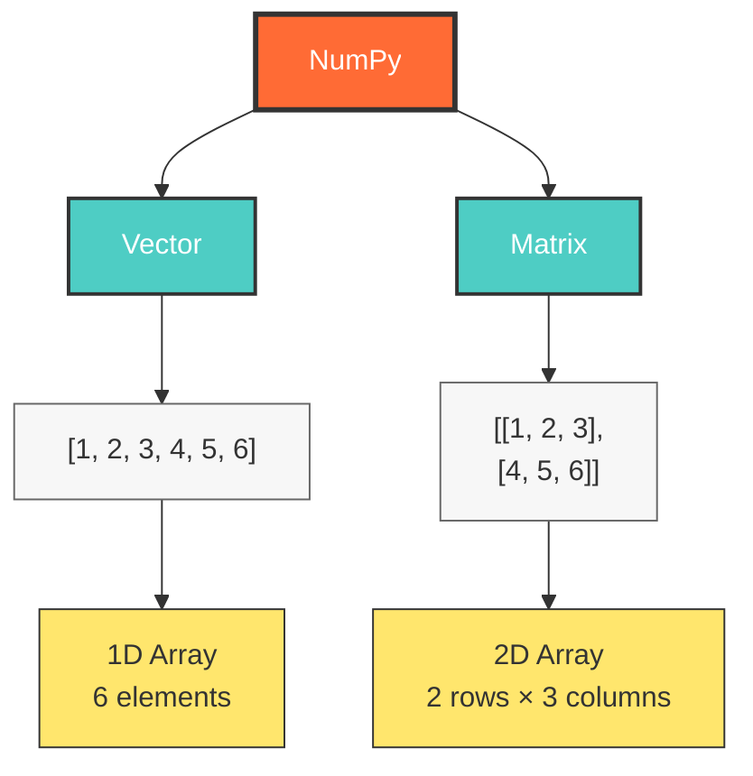

# numpy

```mermaid 
graph TD
    A[NumPy] --> B[Vector]
    A --> C[Matrix]
    
    B --> D["[1, 2, 3, 4, 5, 6]"]
    D --> E["1D Array<br/>6 elements"]
    
    C --> F["[[1, 2, 3],<br/> [4, 5, 6]]"]
    F --> G["2D Array<br/>2 rows × 3 columns"]
    
    style A fill:#ff6b35,stroke:#333,stroke-width:3px,color:#fff
    style B fill:#4ecdc4,stroke:#333,stroke-width:2px,color:#fff
    style C fill:#4ecdc4,stroke:#333,stroke-width:2px,color:#fff
    style D fill:#f7f7f7,stroke:#666,stroke-width:1px
    style F fill:#f7f7f7,stroke:#666,stroke-width:1px
    style E fill:#ffe66d,stroke:#333,stroke-width:1px
    style G fill:#ffe66d,stroke:#333,stroke-width:1px
```
