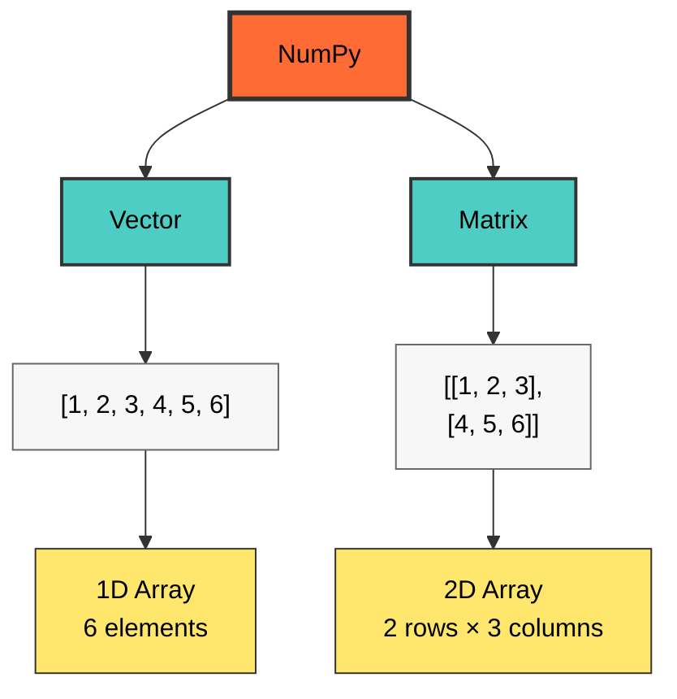
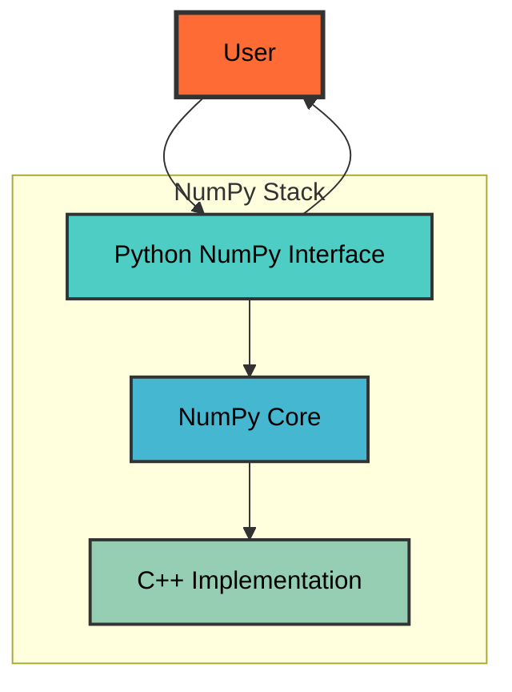

# numpy


## Creating Array from list
```python
import numpy as np

arr_1D = np.array([1,2,3]) 
print(arr_1D)                                output: [1 2 3]

arr_2D = np.array([[1,2,3],[4,5,6]])
print(arr_2D)                                output: [[1 2 3]
                                                      [4 5 6]]
```
## Numpy Array vs Python List
```python
py_list = [1,2,3]
print("python list multiplication : ", py_list * 2)             output: python list multiplication :  [1, 2, 3, 1, 2, 3]

np_array = np.array([[1,2,3]])
print("python numpy array multiplication : ", np_array * 2)     output: python numpy array multiplication :  [[2 4 6]]

import time 

start = time.time()
py_list = [ element * 2 for element in range(100000000)]
print("\n list operation time : ", time.time() - start)           output: list operation time :  12.6350736618042

start = time.time()
np_array = np.arange(100000000)
np_array*2
print("\n list operation Numpy array : ", time.time() - start)    output: list operation Numpy array :  0.7995524406433105
```
